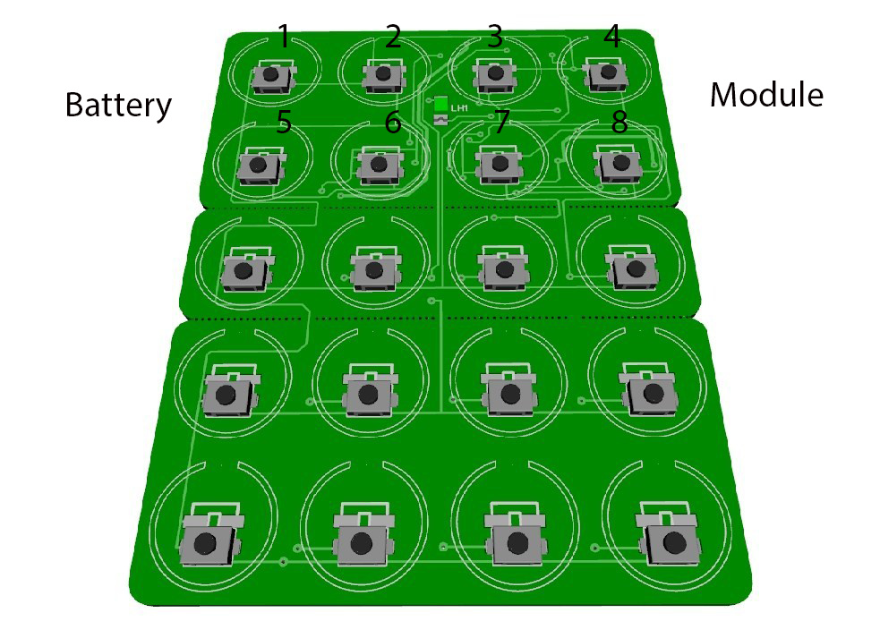

# How to join:
### If device in FN(factory new) state:
1. Press and hold button (1) for 2-3 seconds, until device start flashing led
2. Wait, in case of successfull join, device will flash led 5 times
3. If join failed, device will flash led 3 times

### If device in a network:
1. Hold button (1) for 10 seconds, this will reset device to FN(factory new) status
2. Go to step 1 for FN device


### How to use touch link
1. Bring you remote near to TL device
2. Hold button (2) for 5 seconds

TL funtionality can work without connecting to network


## What's button mapping?


# How to add device into zigbe2mqtt
Lets assume you have install z2m in folder `/app/zigbee2mqtt`

```bash
cd /app/
git clone --single-branch --branch add_freepad git@github.com:diyruz/zigbee-herdsman-converters.git
cd zigbee2mqtt
npm link ../zigbee-herdsman-converters

npm start //start z2m as usual
```


