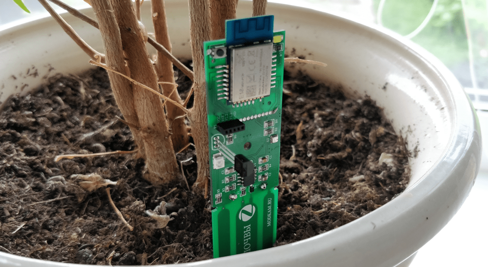

# How to join:
### If device in FN(factory new) state:
1. Press and hold button (1) for 2-3 seconds, until device start flashing led
2. Wait, in case of successfull join, device will flash led 5 times
3. If join failed, device will flash led 3 times

### If device in a network:
1. Hold button (1) for 10 seconds, this will reset device to FN(factory new) status
2. Go to step 1 for FN device

# How to add device into zigbe2mqtt
Use [external converters](https://www.zigbee2mqtt.io/information/configuration.html#external-converters-configuration) feature

Converter file located [here](./z2m-converter/DIYRuZ_Flower.js)

